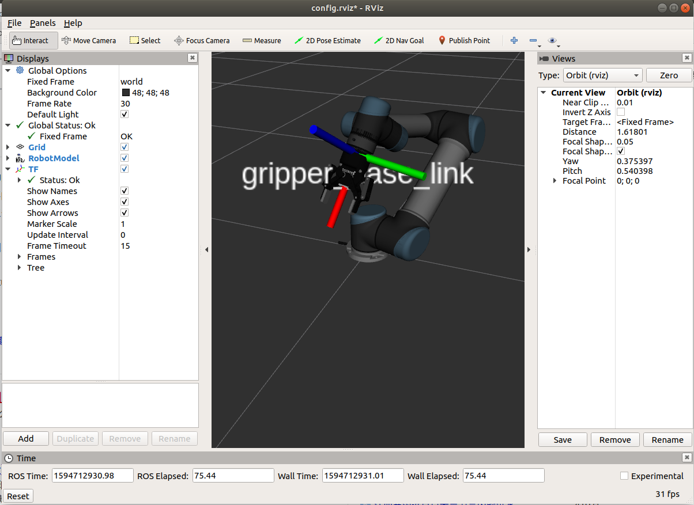

# ros_ur5_robotiq_2f_85
Adding ur5 with robotiq_2f_85 in ROS Melodic, visualizing in RViz and executing on real hardware.

## Environment

* Ubuntu 18.04
* Python 2.7
* gcc/g++ 7.5.0
* ROS-Melodic

## Usage
First clone this repository to your catkin workspace. If you do not have a catkin workspace, please follow this [tutorial](http://wiki.ros.org/ROS/Tutorials/InstallingandConfiguringROSEnvironment#Create_a_ROS_Workspace) to create one.
```
cd $YOUR_CATKIN_WS$/src
git clone https://github.com/Simon-Fuhaoyuan/ros_ur5_robotiq_2f_85.git
```

Next, make these files and source the setup bash.
```
cd .. & catkin_make
source devel/setup.bash
```

Then, run the launch file in ROS. Remember to add your user username to user group dialout, click [here](https://github.com/Simon-Fuhaoyuan/ros_ur5_robotiq_2f_85#usb-and-baud) for more details.
```
roslaunch ros_ur5_robotiq_2f_85 ur5_robotiq_bringup.launch
```
If everything works well, you will see something like this in RViz.



## Procedure
Connecting a hardware with PC in ROS needs the following three steps:

* Rosrun corresponding driver (usually a node in launch file) to get each joint's state of the robot.
* Load the description file (In ROS, this is termed as URDF) about the hardware, usually included in some files with 'upload'.
* Use package 'robot_state_publisher' in ROS to calculate the forward kinematics of the robot based on robot description and publish the robot state to tf.

## Some problems I meet

### USB and baud

The ur5 gripper is connected with PC based on usb. By default, it can be attached in /dev/ttyUSB0, so we need the right to read and wite. Add the username to user group dialout by
```
sudo usermod -a -G dialout $USER
```

### Teleport in RViz

Based on initial robotiq_85 driver [here](https://github.com/StanleyInnovation/robotiq_85_gripper/tree/master/robotiq_85_driver), I found the ur5 robot will teleport frequently in RViz. This is due to the conflict in topic '/joint_states'. Since initial robotiq_85 driver run two nodes:

* robot_state_publisher

* joint_state_publisher

Both these two nodes will have relationship with '/joint_states'. The former one will read data from /joint_states, and the latter one will write data into /joint_states based on the default joint state in URDF. However, when they both work, the joint state from 'joint state_publisher' will have conflict with ur5_driver, which makes the simulated robot in RViz teleporting.

## References
https://github.com/StanleyInnovation/robotiq_85_gripper

https://github.com/ros-industrial/ur_modern_driver

https://github.com/ros-industrial/universal_robot/tree/melodic-devel/ur_description

https://github.com/utecrobotics/ur5/tree/master/ur5_description